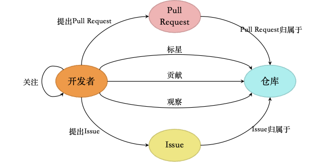
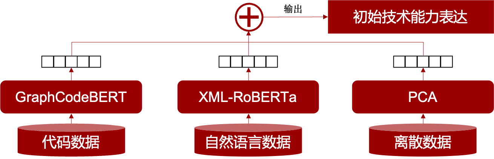
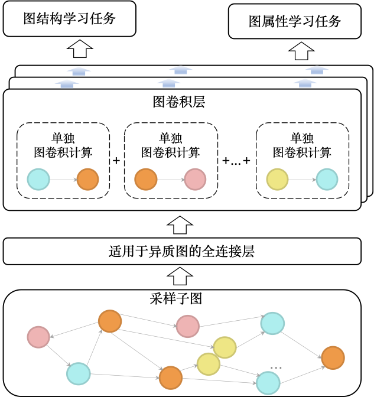

# DTEM (Developer Technical Expertise Mining)
## 简介：
该项目旨在通过GNN建模GitHub中多样的社交关系，并结合深度学习预训练模型给出的初始实体的技术能力嵌入，得到综合反映开发特性和社交特性的GitHub开发者等实体的技术能力，该技术能力以嵌入向量的形式表达。随后本项目基于该技术能力表达向量设计实现了多种GitHub社交和开发关系推荐系统，具体来说，有为开发者推荐相似开发者、为开发者推荐适合贡献的仓库、为仓库推荐合适的维护者以及为仓库的Pull Request推荐合适的评审员等。
整体技术路线图下图所示：


## 详细介绍
### GitHub社交活动图构建
随机采样的50, 000个在2022年发生更改的GitHub开源仓库，采样数据源来自于论文[Sampling Projects in GitHub for MSR Studies. MSR 2021]，本项目使用[GitHub Restful API](https://docs.github.com/en/rest?apiVersion=2022-11-28)获取与开源仓库有关的Pull Request、Issue和开发者实体，并使用该脚本获取了所有实体的**多模态**属性信息，包括：
- 代码模态：仓库代码和Pull Request的代码提交，
- 离散数据：仓库主题（Topic）和编程语言信息，
- 自然语言：仓库README文本、仓库描述、Issue描述和Pull Request描述。

于是本文构建的GitHub社交活动图模式如下：


### GitHub实体初始技术能力表达挖掘
本项目利用实体的多模态属性信息，运用深度学习的预训练模型给出这些实体的初始技术能力表达。对于一类实体，获取它的初始技术能力表达方法如下所示：

此处的代码数据、自然语言数据和离散数据均为实体相应类别的属性信息，它们分别进入GraphCodeBERT、XML-RoBERTa和PCA得到连续的向量表示，这些向量的拼接得到最终的初始技术能力表达。之所以使用PCA模型，是因为目前挖掘得到的离散属性信息稀疏性过于严重，PCA可以帮助降维和去除噪音。

**注意**：此处开发者实体是没有初始技术能力表达的，因为GitHub中关于开发者属性信息少之又少。

### GitHub社交关系建模
本文使用图卷积神经网络模型建模GitHub社交活动图中的各种社交关系。它的模型结构如下所示：


图神经网络模型的初始输入为节点的初始技术能力表达向量和一个反映全局结构信息的Metapath2Vec嵌入得到。由于本文构建的社交活动图为异构图，本文对GraphSAGE图卷积层进行了适应于异构图的改进，即将输入的图数据按照边类型拆分为若干个子图，分别构建单独的GraphSAGE图卷积层进行计算，这些图卷积层输出的加和才是最终的单层图卷积层的输出。由于社交活动图过大，本文对图进行了采样处理，对每个目标节点采样15个邻居构成计算依赖子图，由此组成batch进行mini-batch方式的训练。本文的图卷积神经网络模型的训练任务有两类，图结构学习任务包括链接预测任务和边分类，图属性学习任务包括贡献关系权重预测。**训练好的图神经网络输出就是本文得到的GitHub开发者等实体的技术能力表达！**

### GitHub多种社交和开发关系推荐
本文选择的社交和开发关系推荐任务包括GitHub 相似用户群体推荐、适合关注贡献的仓库推荐、仓库维护者推荐、Pull Request 评审员推荐。本项目分别从全体数据集中抽取了相应的正样本数据和负样本数据，并微调技术能力表达来适配各种下游任务。微调的模型为简单的前馈神经网络，本项目将其命名为评分模型，推荐系统的构建方式同样非常简单，以与中心实体评分模型输出最高的20个实体作为推荐结果。

### 附：GitHub实体技术能力可视化
本项目同样尝试将以嵌入向量表达的技术能力表达映射到GitHub典型主题进行技能可视化，本项目选择数据集为仓库以及其对应的典型主题数据，并使用简单前馈神经网络模型为基础构建了若干个二分类模型，实现该目标。

## 项目树介绍
```
.
├── Comparisons                         # 三个对比实验
│   └── experiments                         # 对比试验所用脚本
│       ├── alpha				# 用Dev2Vec论文中提到的给开发者建模的方法
│       ├── beta				# 在社交关系图上删去watch关系
│       └── gamma 				# 用SMEF论文中的社交网络的方法做对比
├── GHCrawler                           # GitHub数据获取
│   ├── cleaned                             # 清洗数据存放处  
│   ├── export                              # 可用数据存放处               
│   ├── log
│   ├── rawdata                             # 原始获取数据存放处
│   └── readme                              # 获取的仓库README存放处
├── GNN                                 # GNN模型试验
│   ├── DataPreprocess                      # 构建GitHub社交活动图，并设置好节点嵌入初始向量
│   ├── HGT                                 # HGT模型
│   ├── HetGAT                              # HetGAT模型
│   ├── HetGCN                              # HetGCN模型
│   ├── HetSAGE                             # HetSAGE模型，本项目最终选用的模型
│   ├── RGCN                                # RGCN模型
│   └── Visualize                           # 部分子图的可视化
├── NodeFeatureInitializer              # 实体技术能力属性初步获取
│   ├── IssueEmbedding                      # Issue实体特征信息
│   ├── PREmbedding                         # PR实体特征信息
│   ├── RepositoryCodeEmbedding             # 仓库代码特征信息
│   ├── RepositoryEmbedding                 # 仓库实体特征信息
│   ├── export                              # 对外展示的可用向量形式的特征信息
│   └── parser                              # tree-sitter的多种编程语言的parser
│       ├── tree-sitter-c-sharp
│       ├── tree-sitter-go
│       ├── tree-sitter-java
│       ├── tree-sitter-javascript
│       ├── tree-sitter-php
│       ├── tree-sitter-python
│       └── tree-sitter-ruby
├── RecommendationTasks                 # 各种下游推荐任务设计
│   ├── ContributionRepo                    # 为开发者推荐合适贡献的仓库
│   ├── ContributionRepo_CF                 # 使用协同过滤方法
│   ├── PRReviewer                          # 为仓库PR推荐合适评审员
│   ├── PRReviewer_CF                       # 使用协同过滤方法
│   ├── RepoMaintainer                      # 为仓库推荐合适的维护者
│   ├── RepoMaintainer_CF                   # 使用协同过滤方法
│   ├── SimDeveloper                        # 为开发者推荐相似开发者
│   ├── SimDeveloper_CF                     # 使用协同过滤方法
│   └── TopicEmbedding                      # 主题方法的实体嵌入数据
├── T-Test                              # 无监督T-检验实验
│   ├── user_contribute_repository          # 无监督任务1
│   └── user_join_repository                # 无监督任务2
```
## 项目数据
后面将会以外部链接的形式放在这里（挖坑）。

